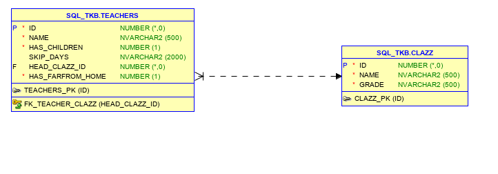

# 1. Giới thiệu về HQL - Hibernate Query Language
- Hibernate Query Language (HQL) là một ngôn ngữ truy vấn hướng đối tượng (OOP), tương tự như SQL (Structured Query Language) nhưng thay vì làm việc trên các bảng và cột, HQL làm việc với các đối tượng persistent và các thuộc tính của chúng. Các truy vấn HQL được  đổi bởi Hibernate thành các truy vấn SQL thông thường, lần lượt thực hiện các công việc trên cơ sở dữ liệu. Nhờ vậy mà nó là một ngôn ngữ truy vấn độc lập cơ sở dữ liệu, không phụ thuộc vào bất kỳ database nào.
# 2. Đặc điểm của HQL
- Case Sensitivity: HQL không phân biệt hoa thường, ngoại trừ các thuộc tính như tên class, thuộc tính, tên biến có phân biệt chữ hoa chữ thường. Chẳng hạn: SeLeCT, SELECT, select là như nhau. Tuy nhiên, com.gpcoder.entities.User và com.gpcoder.entities.USER là khác nhau.

- HQL From: mệnh đề From trong HQL có ý nghĩa tương đương với SQL, chúng ta cũng có thể đặt alias (as) cho nó. Chẳng hạn: From User u, là tương đương với SELECT * From User as u.

- HQL Join: HQL hỗ trợ tất cả loại join trong SQL như INNER JOIN, LEFT JOIN, RIGHT JOIN, FULL JOIN.

- Aggregate Function: hỗ trợ rất nhiều aggregate function như count(*), count(distinct x), min(), max(), avg() and sum().

- Expressions: chúng ta có thể sử dụng các biểu thức so sánh, tính toán trong HQL như: arithmetic expressions (+, -, *, /), omparison operators (=, >=, <=, <>, !=, like), omparison operators (=, >=, <=, <>, !=, like), …

Ngoài ra, HQL còn hỗ trợ:

- Order by, group by, having, Sub-query, … tương tự như SQL.

- DM (Ngôn ngữ Thao tác Dữ liệu – Data Manipulation Language): INSERT, UPDATE và DELETE là các câu lệnh DML.

- DDL (Ngôn ngữ Định nghĩa Dữ liệu – Data Definition Language): CREATE, ALTER, DROP, RENAME là các câu lệnh DDL.

- Thực thi store procedure.

# 3. Ví dụ 
## 3.1 Cơ sở dữ liệu
<p align = "center">

<p>

## 3.2 Tạo các entity và các mapping với bảng có trong db
```java
- Class clazz
    package com.github.truongbb.timetableschedule.entity;

    import lombok.AccessLevel;
    import lombok.AllArgsConstructor;
    import lombok.Data;
    import lombok.NoArgsConstructor;
    import lombok.experimental.FieldDefaults;

    import javax.persistence.Column;
    import javax.persistence.Entity;
    import javax.persistence.Id;
    import javax.persistence.Table;
    import java.io.Serializable;

    @Entity
    @Table(name = "CLAZZ")
    @Data
    @NoArgsConstructor
    @AllArgsConstructor
    @FieldDefaults(level = AccessLevel.PRIVATE)
    public class Clazz implements Serializable {

        @Id
        @Column(nullable = false)
        Integer id;

        @Column(nullable = false)
        String name;

        @Column(nullable = false)
        String grade;

    }

```

- teacher.java
```java
    package com.github.truongbb.timetableschedule.entity;

    import lombok.AccessLevel;
    import lombok.AllArgsConstructor;
    import lombok.Data;
    import lombok.NoArgsConstructor;
    import lombok.experimental.FieldDefaults;

    import javax.persistence.*;
    import java.io.Serializable;
    import java.util.List;

    @Entity
    @Table(name = "TEACHERS")
    @Data
    @NoArgsConstructor
    @AllArgsConstructor
    @FieldDefaults(level = AccessLevel.PRIVATE)
    public class Teacher implements Serializable {

        @Id
        @Column(nullable = false)
        Integer id;

        @Column(nullable = false)
        String name;

        @Column(name = "HAS_CHILDREN")
        Boolean hasChildren;

        @Column(name = "SKIP_DAYS")
        String skipDays;

        @JoinColumn(name = "HEAD_CLAZZ_ID")
        @ManyToOne(targetEntity = Clazz.class)
        Clazz headClazz;

        @Column(name = "HAS_FARFROM_HOME")
        Boolean hasFarfromHome;

    }

```
# 3.3 Hibernate configuration yml
- Tạo file application.yml và đặt nó vào thư mục src/main/resources.

```java
server:
  port: 9870
  servlet:
    encoding:
      charset: UTF-8
      enabled: true

spring:
  application:
    name: 'tim-table-scheduling'

  jpa:
    database-platform: org.hibernate.dialect.Oracle10gDialect
    properties:
      hibnernate:
        jdbc:
          batch_size: 5000
    show-sql: true

  datasource:
    driver-class-name: oracle.jdbc.driver.OracleDriver
    url: jdbc:oracle:thin:@localhost:1521:xe
#    username: sql_tkb
#    password: 123456
// điền username vá password đối với db muốn mapping
    username: tkb_c3  // tên user
    password: admin // pass
    dbcp2:
      test-while-idle: true
      validation-query: SELECT 1 FROM DUAL

```

# 3.4 Tạo repository để thao tác với db

<p align = "center">

</p>

VD: thao tác với clazz

- Tạo interface ClazzRepository:
```java
    package com.github.truongbb.timetableschedule.repository.clazz;

    import com.github.truongbb.timetableschedule.entity.Clazz;

    import java.util.List;

    public interface ClazzRepository {

        List<Clazz> getAll();

    }

```
- Tạo class ClazzRepositoryImpl kế thừa lớp interface ClazzRepository
```java
package com.github.truongbb.timetableschedule.repository.clazz;

import com.github.truongbb.timetableschedule.entity.Clazz;
import com.github.truongbb.timetableschedule.entity.Subject;
import com.github.truongbb.timetableschedule.repository.BaseRepository;
import org.springframework.stereotype.Repository;

import java.util.List;

@Repository
public class ClazzRepositoryImpl extends BaseRepository implements ClazzRepository {

    @Override
    public List<Clazz> getAll() {

        return getSession().createQuery("from Clazz", Clazz.class).list();
    }

}
```
**
- getSession().createQuery("from Clazz", Clazz.class).list(): trả về 1 danh sách tất cả các đối tượng có trong clazz. 
```java
 getSession()
    .createQuery("select t from Teacher t join Clazz c on c.id = t.headClazz.id where c.name = :p_class_name", Teacher.class)

    .setParameter("p_class_name", className)

    .getSingleResult()


    // trả về 1 đối tượng teacher thỏa mãn điều khiện where
    //join để kết nối 2 entity teacher và clazz
```